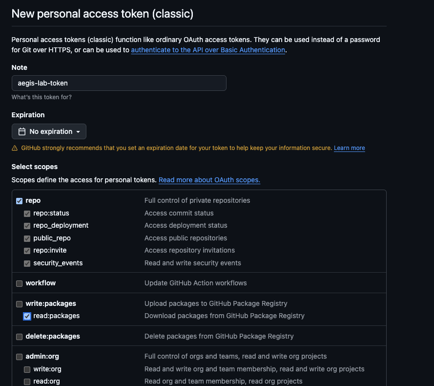

# Mac 非エンジニア向けセットアップガイド

プログラミング経験がない方向けの詳細ガイドです。

---

## 1. ターミナルを開く

ターミナルは、コマンドを入力してコンピュータを操作するアプリです。

**方法1: Spotlight検索**
1. `Command (⌘) + Space` を押す
2. 「ターミナル」と入力
3. `Enter` を押す

**方法2: Finder**
1. 「アプリケーション」→「ユーティリティ」→「ターミナル」をダブルクリック

---

## 2. Xcode Command Line Tools をインストール

ターミナルで実行:
```bash
git --version
```

→ ポップアップが表示されたら「インストール」をクリック（5〜10分）

**確認**:
```bash
git --version
# → git version 2.x.x と表示されればOK
```

---

## 3. Node.js をインストール

**方法1: ダウンロードページから（簡単）**

1. [Node.js ダウンロードページ](https://nodejs.org/ja/download) にアクセス
2. **macOS インストーラー（.pkg）** をクリックしてダウンロード
3. ダウンロードした `.pkg` ファイルをダブルクリックしてインストール

**方法2: ターミナルから（推奨）**

以下のコマンドをターミナルにコピー＆ペーストして実行:
```bash
# nvm をダウンロードしてインストール
curl -o- https://raw.githubusercontent.com/nvm-sh/nvm/v0.40.3/install.sh | bash

# シェルを再起動する代わりに実行
\. "$HOME/.nvm/nvm.sh"

# Node.js をダウンロードしてインストール
nvm install 24
```

**確認**:
```bash
node -v
# → v24.x.x と表示されればOK
```

---

## 4. GitHub Token を設定

### 4.1 Token を作成

1. [github.com/settings/tokens/new](https://github.com/settings/tokens/new) にアクセス
2. 「Generate new token (classic)」を選択
3. 設定:
   - **Note**: `aegis-lab-token`
   - **Expiration**: `No expiration`
   - **Scopes**: ✅ `repo`（全部）、✅ `read:packages`



4. 「Generate token」をクリック
5. 表示されたトークン（`ghp_...`）をコピー（**二度と表示されません**）

### 4.2 Token を設定

```bash
echo "//npm.pkg.github.com/:_authToken=YOUR_TOKEN" >> ~/.npmrc
```

`YOUR_TOKEN` を実際のトークンに置き換えてください。

**確認**:
```bash
cat ~/.npmrc
# → //npm.pkg.github.com/:_authToken=ghp_... と表示されればOK
```

---

## 5. リポジトリをクローン

```bash
cd ~/Desktop  # または好きな場所
git clone https://github.com/legalforce/aegis-lab.git
cd aegis-lab
```

---

## 6. 依存関係をインストール

```bash
corepack enable
```

権限エラーが出たら:
```bash
sudo corepack enable
# Mac のログインパスワードを入力
```

依存関係をインストール:
```bash
pnpm install
```

---

## 7. 開発サーバーを起動

```bash
pnpm dev
```

→ http://localhost:5173 がブラウザで開けばOK

**停止**: `Control (⌃) + C`

---

## 8. (オプション) Rust をインストール — デスクトップアプリ開発用

デスクトップアプリ（`pnpm tauri:dev`）を使う場合のみ必要です。Web 開発のみであればスキップしてください。

```bash
curl --proto '=https' --tlsv1.2 -sSf https://sh.rustup.rs | sh
```

→ プロンプトが表示されたらそのまま `Enter`（デフォルトの `1) Proceed with standard installation` を選択）

インストール完了後、ターミナルを再起動するか以下を実行:

```bash
. "$HOME/.cargo/env"
```

**確認**:
```bash
rustc --version
# → rustc 1.x.x と表示されればOK

cargo --version
# → cargo 1.x.x と表示されればOK
```

これでデスクトップアプリの開発が可能になります:
```bash
pnpm tauri:dev
```

詳細は [tauri-guide.md](./tauri-guide.md) を参照してください。

---

## よくあるエラー

### GitHub 認証エラー（401）

```
ERR_PNPM_FETCH_401 Unauthorized
```

→ GitHub Token の権限を確認。`repo` と `read:packages` の両方が必要。

### 権限エラー（EACCES）

```
Error: EACCES: permission denied
```

→ コマンドの前に `sudo` を付けて再実行。

---

詳細なトラブルシューティング: [troubleshooting.ja.md](./troubleshooting.ja.md)
